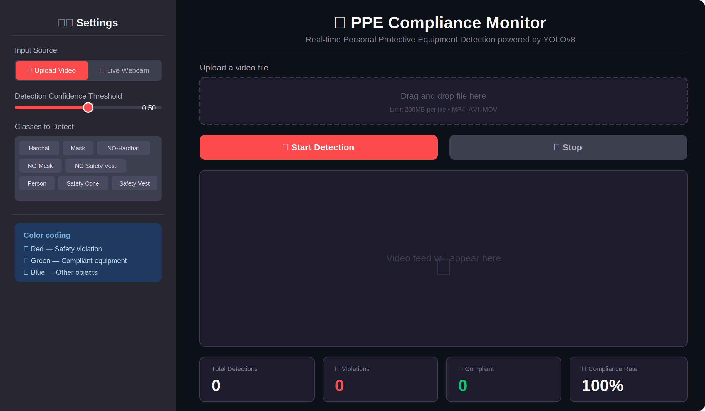
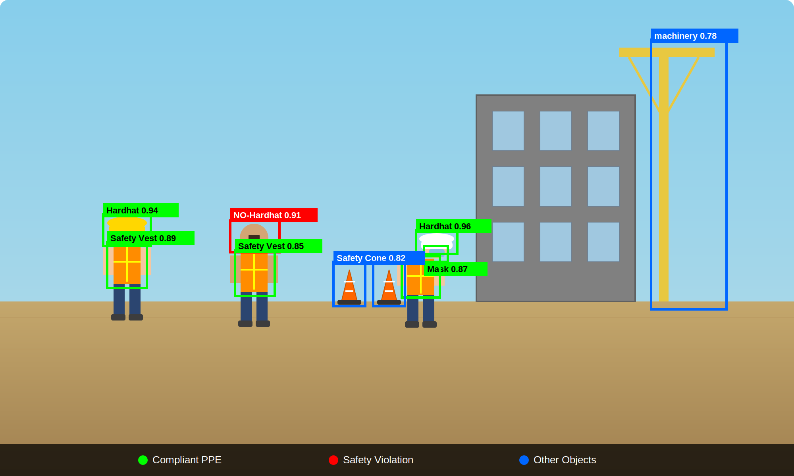
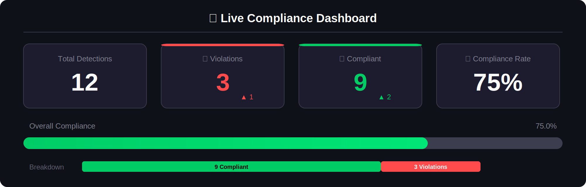

# 🦺 PPE Compliance Monitor

Real-time Personal Protective Equipment detection powered by **YOLOv8** and **Streamlit**.

Upload a construction-site video or connect a live webcam and the system detects hardhats, safety vests, masks, and flags any missing equipment as a violation — with a live compliance dashboard.

---

## Screenshots

### App Overview
The full interface: sidebar settings on the left, video feed and controls on the right.



### Detection in Action
Color-coded bounding boxes drawn on a construction scene — green for compliant PPE, red for violations, blue for other objects.



### Live Compliance Dashboard
Real-time metrics update every frame: total detections, violations, compliant count, and overall compliance rate with a progress bar.



---

## Features

- **Video upload** — process `.mp4`, `.avi`, `.mov` files frame-by-frame
- **Live webcam** — real-time detection from a connected camera
- **Adjustable confidence threshold** — tune sensitivity from the sidebar
- **Class filter** — choose which of the 10 object classes to detect
- **Live stats dashboard** — total detections, violations, compliant count, and compliance rate updated every frame
- **Color-coded bounding boxes** — 🔴 Red = violation, 🟢 Green = compliant, 🔵 Blue = other

### Detected classes

| Compliant (green) | Violation (red) | Other (blue) |
|---|---|---|
| Hardhat | NO-Hardhat | Person |
| Safety Vest | NO-Safety Vest | Safety Cone |
| Mask | NO-Mask | machinery |
| | | vehicle |

---

## Repository structure

```
Person-Protective-Equipment-Detection/
├── assets/                   # Screenshots used in README
│   ├── app_overview.png
│   ├── detection_view.png
│   └── stats_dashboard.png
├── app.py                    # Streamlit web application (main entry point)
├── PPE_detection.py          # Original OpenCV-only detection script
├── best.pt                   # Pre-trained YOLOv8 model weights
├── requirements.txt          # Python dependencies
├── .gitignore
└── README.md
```

> **Not included in the repo (gitignored):**
> `Videos/` — sample construction-site clips, and
> `Custom Training/` — YOLOv8 training notebook and dataset.
> These are excluded to keep the repository lightweight. See [Custom training](#custom-training) below if you want to retrain the model.

---

## Getting started

### Prerequisites

- **Python 3.9 or newer** — [download](https://www.python.org/downloads/)
- **Git** — [download](https://git-scm.com/downloads)
- A **webcam** (only needed for live-camera mode)

### 1. Clone the repository

```bash
git clone https://github.com/<your-username>/Person-Protective-Equipment-Detection.git
cd Person-Protective-Equipment-Detection
```

### 2. Create a virtual environment (recommended)

```bash
# Windows
python -m venv venv
venv\Scripts\activate

# macOS / Linux
python3 -m venv venv
source venv/bin/activate
```

### 3. Install dependencies

```bash
pip install -r requirements.txt
```

### 4. Verify the model weights

Make sure `best.pt` is present in the project root. This file contains the trained YOLOv8 weights and is required for detection. It is included in the repository.

### 5. Run the app

```bash
streamlit run app.py
```

The app will open automatically at `http://localhost:8501`.

---

## Usage

1. **Upload mode** — Click *Upload Video*, pick any `.mp4`/`.avi`/`.mov` construction-site video, then press **▶ Start Detection**.
2. **Webcam mode** — Switch to *Live Webcam* in the sidebar, then press **🎥 Start Webcam**.
3. Adjust the **confidence threshold** and **class filter** in the sidebar at any time.
4. Press **⏹ Stop** to halt processing.

---

## Running the original script (optional)

The original OpenCV-window script is still available:

```bash
pip install cvzone
python PPE_detection.py
```

> This opens a desktop `cv2.imshow` window and requires `cvzone`. The Streamlit app does **not** need `cvzone`.
>
> **Note:** The script has a hardcoded path (`Videos/ppe-3-1.mp4`). Create a `Videos/` folder and place your own video in it, or edit the path in `PPE_detection.py` before running.

---

## Custom training

The training notebook (`Model_Custom_training.ipynb`) and dataset used to produce `best.pt` are not included in this repository to keep it lightweight. To retrain or fine-tune the YOLOv8 model on your own PPE dataset:

1. Prepare your dataset in YOLOv8 format (images + label `.txt` files).
2. Follow the [Ultralytics training guide](https://docs.ultralytics.com/modes/train/).
3. After training, copy the new `best.pt` from the `runs/` output into the project root, replacing the existing weights file.

---

## Troubleshooting

| Problem | Fix |
|---|---|
| `ModuleNotFoundError: No module named 'ultralytics'` | Run `pip install -r requirements.txt` inside your activated virtual environment. |
| `best.pt` not found | Make sure the weights file is in the project root, not inside a subfolder. |
| Webcam not detected | Ensure no other application is using the camera. Try restarting and running the app again. |
| Video doesn't play | Confirm the file is a valid `.mp4`, `.avi`, or `.mov`. Re-encode with FFmpeg if needed: `ffmpeg -i input.mov -c:v libx264 output.mp4` |
| Port 8501 already in use | Run `streamlit run app.py --server.port 8502` to use a different port. |

---

## License

This project is provided for educational and demonstration purposes.